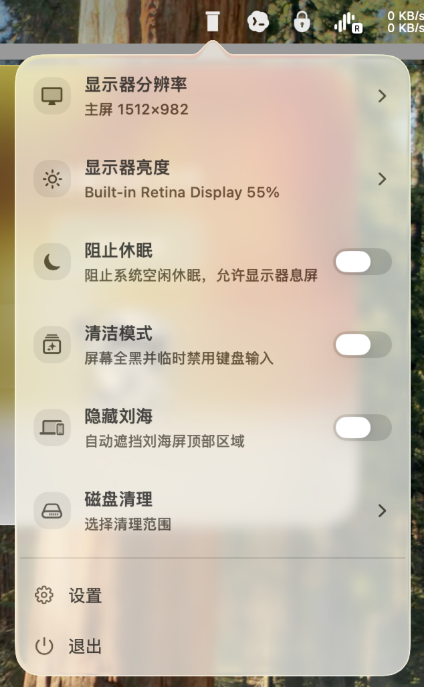
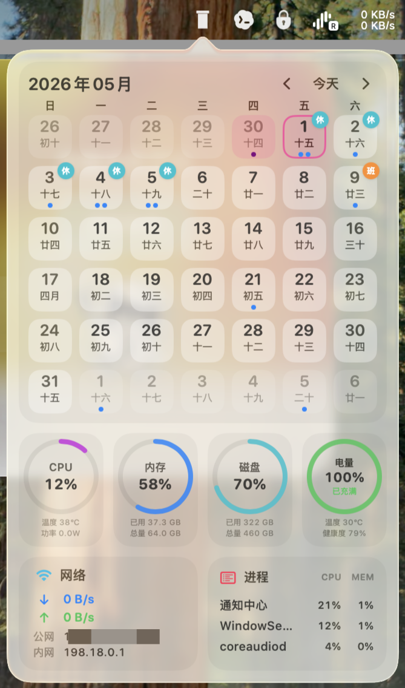
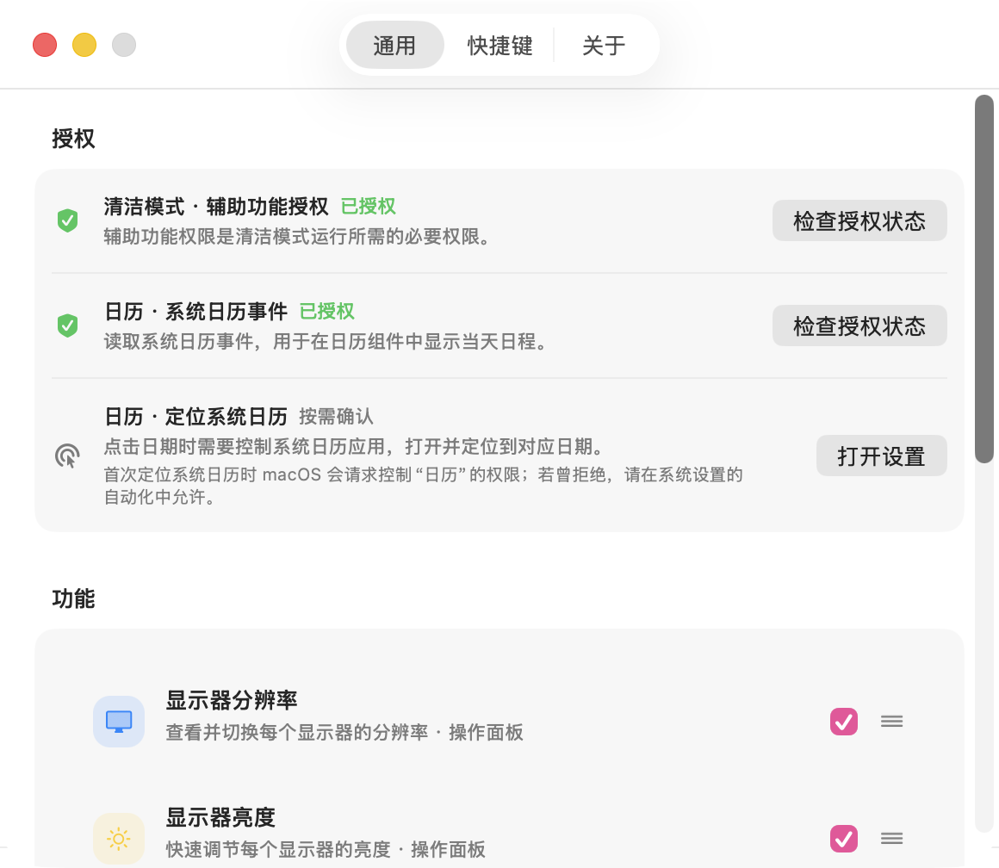
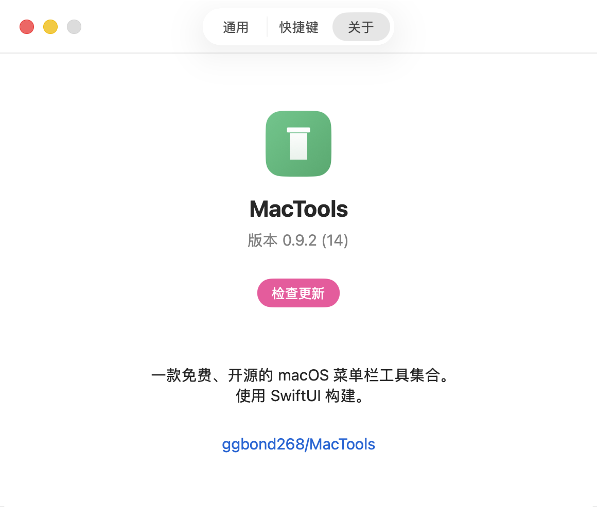

<div align="center">
  
  <h1>MacTools</h1>
  <p><strong>免费、开源的原生 macOS 菜单栏工具集合。</strong></p>
  <p>聚合高频系统能力，保持轻量、快速、低打扰。使用 SwiftUI + AppKit 构建，支持 macOS 14.0 及以上版本。</p>
</div>

## 截图

| 菜单栏功能面板 | 组件仪表盘 |
| --- | --- |
|  |  |

| 设置与权限 | 关于与更新 |
| --- | --- |
|  |  |

## 功能

| 功能 | 说明 |
| --- | --- |
| 显示器分辨率 | 查看已连接显示器，并按显示器切换可用分辨率。 |
| 显示器亮度 | 快速调节内建屏、DDC/CI 外接屏亮度，并提供 Gamma/Shade 回退。 |
| 阻止休眠 | 保持系统空闲时唤醒，支持 30 分钟、1 小时、2 小时、5 小时后自动停止。 |
| 清洁模式 | 全屏黑色覆盖并临时禁用输入，适合清洁屏幕、键盘或触控板。 |
| 隐藏刘海 | 自动遮挡内建刘海屏顶部区域，不修改用户原始壁纸。 |
| 磁盘清理 | 扫描缓存、开发者缓存与浏览器缓存，执行前进行路径安全和敏感数据保护校验。 |
| 日历组件 | 在组件面板中查看月历、农历、节假日与当天日程。 |
| 系统状态 | 展示 CPU、内存、磁盘、电量、网络速率与高占用进程。 |
| 快捷键与设置 | 集中管理权限、功能显示顺序、全局快捷键、版本信息与更新检查。 |

## 特性

- 菜单栏常驻，默认不进入 Dock，适合后台长期运行。
- 插件化架构，菜单功能与组件面板可按需启用、隐藏和排序。
- 原生 macOS 视觉与交互，主面板、详情面板、设置页体验一致。
- 对权限、显示器、文件路径和系统 API 调用保留失败分支与降级路径。

## 开发

```bash
make setup      # 生成 LocalConfig.xcconfig，请填写 DEVELOPMENT_TEAM 与 BUNDLE_IDENTIFIER_PREFIX
make generate   # 使用 XcodeGen 生成 MacTools.xcodeproj
make build      # 编译校验
make run        # 本地运行
```

运行完整测试：

```bash
xcodebuild -project MacTools.xcodeproj -scheme MacTools -configuration Debug -derivedDataPath build/DerivedData test -quiet
```

贡献、测试和发布流程请参考 [CONTRIBUTING.md](CONTRIBUTING.md)。
