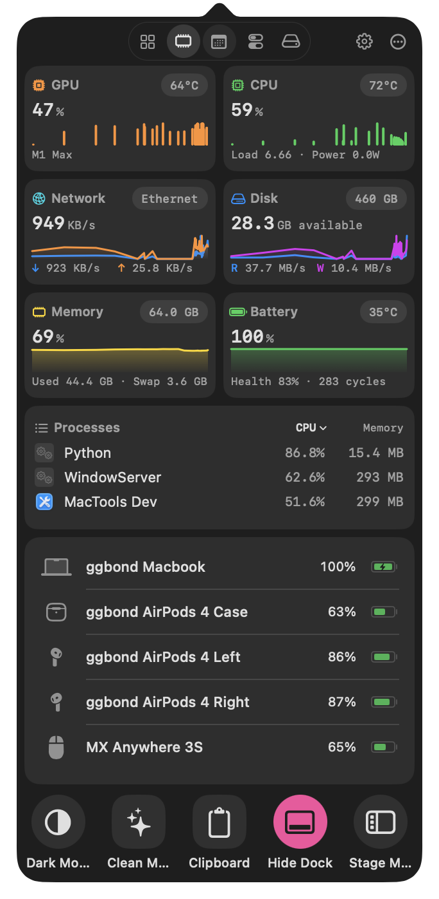
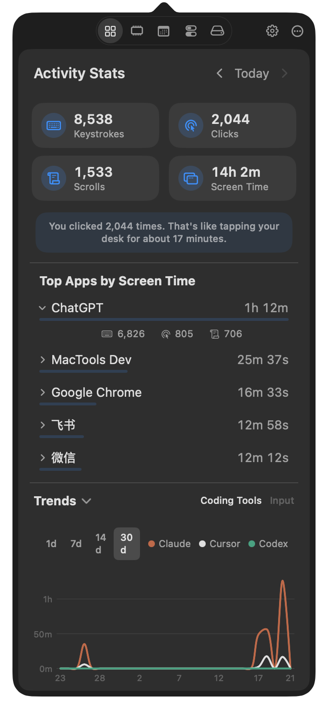
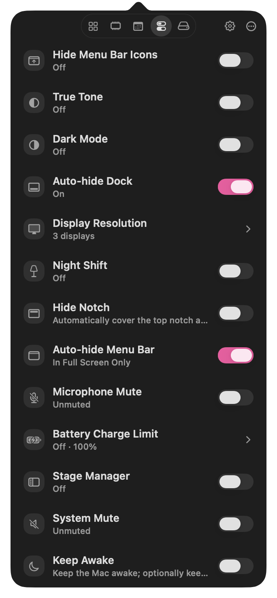
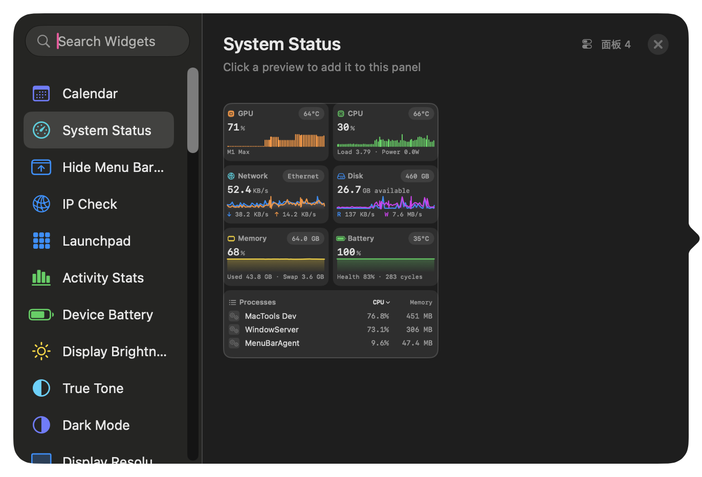
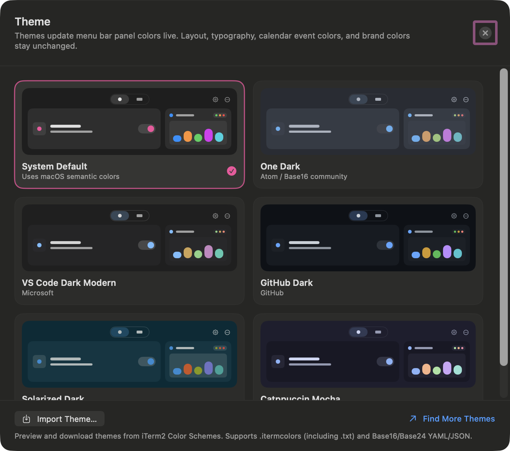
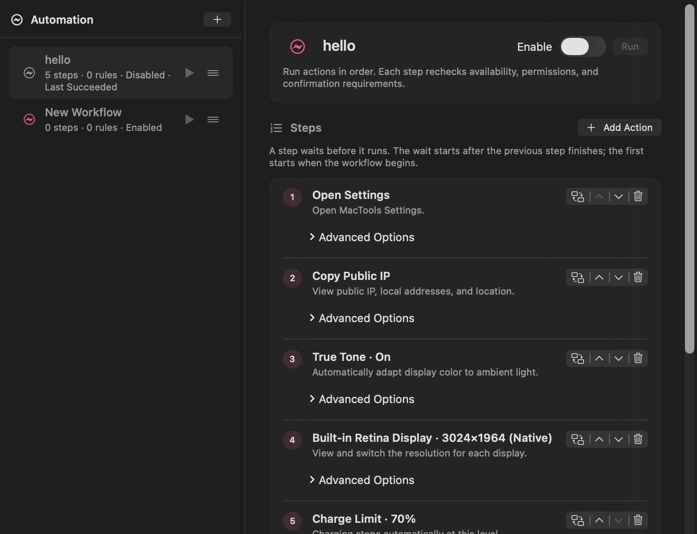
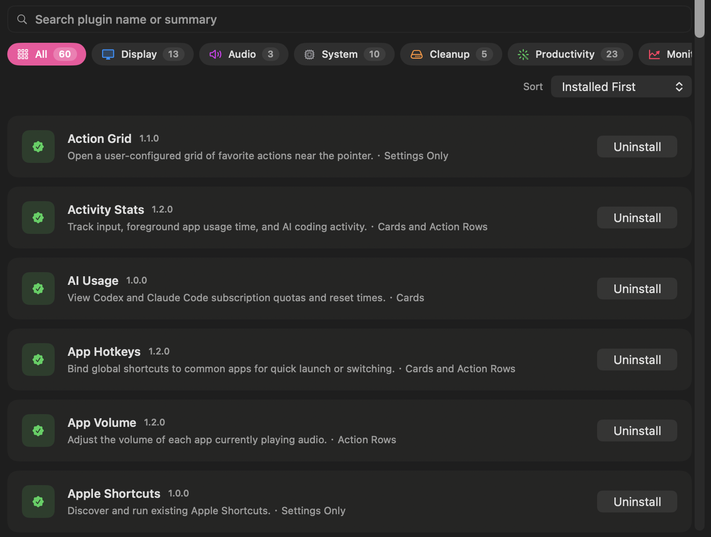
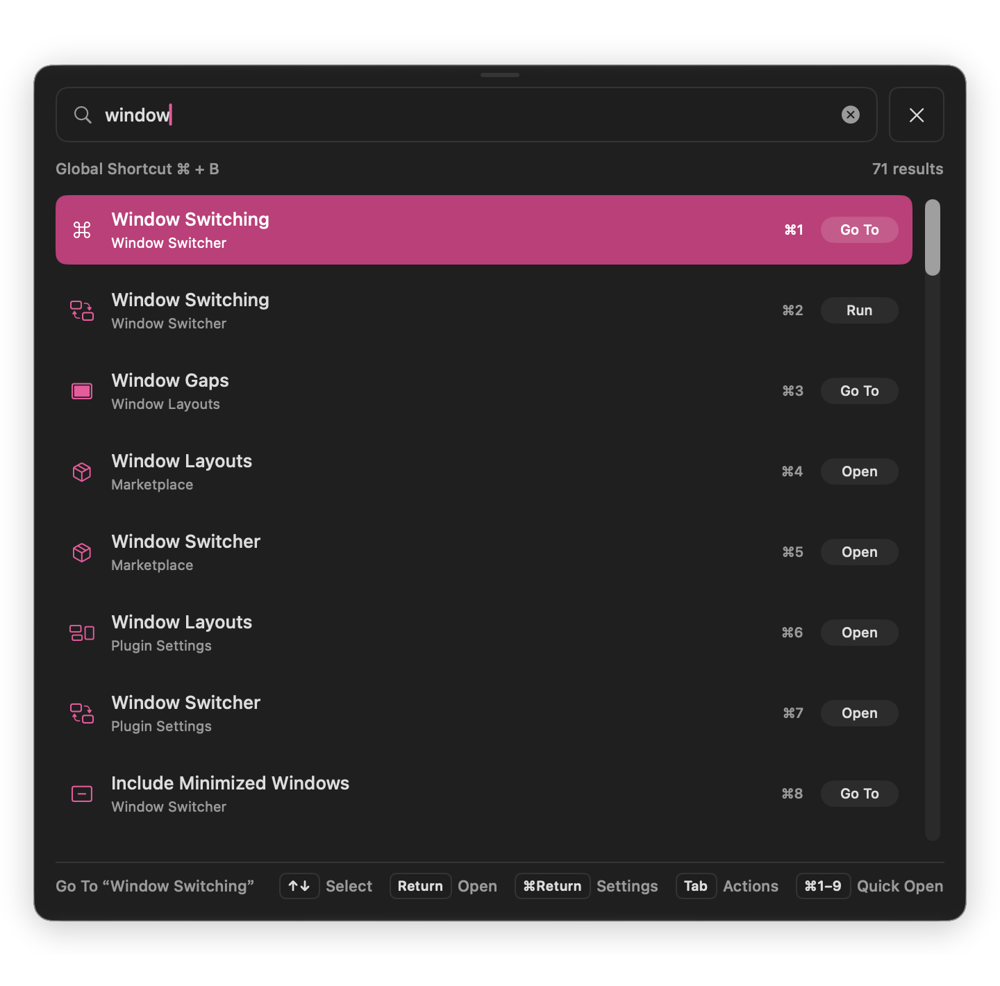

<div align="center">
  
  <h1>MacTools</h1>
  <p><strong>Your Mac's everyday tools, right in the menu bar.</strong></p>
  <p>Free, open source, and native to macOS. Build your own panels, connect actions, and add the tools you need.</p>
  <p><strong>English</strong> · <a href="README.zh-CN.md">简体中文</a></p>
  <p>
    <a href="https://github.com/ggbond268/MacTools/releases"></a>
    
    <a href="LICENSE"></a>
  </p>
  <p><a href="https://mactools.ggbond.app">Website</a> · <a href="https://github.com/ggbond268/MacTools/releases">Download</a> · <a href="docs/README.md">Documentation</a> · <a href="https://github.com/ggbond268/MacTools/issues">Feedback</a></p>
</div>

<p align="center">
  <a href="docs/assets/screenshots/readme/dashboard-en-dark.png"></a>
  <a href="docs/assets/screenshots/readme/activity-en-dark.png"></a>
  <a href="docs/assets/screenshots/readme/controls-en-dark.png"></a>
</p>

## Install

```bash
brew install --cask mactools
```

Or download the app from [GitHub Releases](https://github.com/ggbond268/MacTools/releases). Requires **macOS 14 or later**; some plugins need newer macOS versions or compatible hardware.

Open MacTools, choose plugins in **Settings → Marketplace**, then arrange your menu bar panels. Permissions are requested as needed.

Plugin shortcut settings use the same separate section headings and native cards as other settings, without empty-section gaps or redundant navigation buttons.

Custom settings workspaces use adaptive system backgrounds that coordinate with native settings cards. Search fields, inset previews, and selected controls retain distinct visual roles in light and dark appearance.

System Status settings support full-row expansion and dragging, with category icons, plain row backgrounds, visibility buttons that distinguish shown and hidden items, and insertion lines that mark the drop position. Styles and layouts use segmented controls; the first and optional second values use independent dropdowns, including duplicate choices. Common settings and the live menu bar preview remain visible above the list. Only Memory offers chart selection in Widget Panel settings, using a native segmented control for Usage and Pressure. CPU and GPU keep usage charts, disk keeps read/write rates, network keeps download/upload rates, and battery keeps charge level; these items have no extra settings disclosure. The memory choice applies to both the card and detail chart, with usage as the default. Pressure displays a percentage estimated from wired memory plus the physical memory occupied by the compressor, divided by physical memory; the detail view explains this formula. Its chart uses a fixed 0–100% scale; colors independently reflect the native Normal, Warning, and Critical levels. Older level-only history is not converted into percentages. Missing readings leave gaps in charts.

Expand Processes to choose a maximum of 3 (default), 5, 10, 15, or 20 entries. Processes are grouped by application before ranking, with CPU summed at 100% per core and memory reported as physical footprint; incomplete memory totals show a dash. Visible lists refresh about every 3 seconds and stop scanning when hidden. Reopening a panel immediately shows its latest in-memory snapshot while refreshing newly requested or overdue sources; closing the panel does not expire displayed readings. Completed metric groups appear without waiting for process scans. Disabled sources and plugin shutdown clear their displayed values, and presentation-only readings are excluded from new history records. Collection follows selected menu bar values, enabled chart histories, and visible card/detail values; unused sensors stop, and no sampling loop runs when nothing needs data. Each source keeps its required cadence, so showing one menu bar metric does not accelerate unrelated background charts. History retains observed pressure peaks and collection boundaries across restarts; scalar averages weight valid elapsed time and exclude gaps. The menu bar overview uses a continuous native popover background and stable anchoring. Network readings total active physical interfaces without virtual duplicates. CPU power remains visible between slow sensor updates and expires after one minute without a new reading. See the [metric collection review](docs/reviews/2026-09-23-system-status-metrics.md) and [chart choices and sampling review](docs/reviews/2026-09-23-system-status-chart-metrics.md) for definitions, references, and performance observations.

System Status card badges consistently use secondary text, including memory pressure status; chart colors retain their metric and status meanings.

CPU usage and transfer-rate averages use the actual counter sampling intervals, with weighted totals preserved through history compaction. Cached display values do not add new rate samples. Older history remains visible, but readings without recorded intervals do not contribute to these averages.

<details>
<summary>Updates and Nightly builds</summary>

MacTools checks for app updates automatically. With Homebrew:

```bash
brew update
brew upgrade --cask --greedy mactools
```

Try development features with `MacTools-Nightly.dmg` from a [`nightly-*` prerelease](https://github.com/ggbond268/MacTools/releases). Nightly has separate preferences and plugins and can coexist with the stable app. It is intended for testing; hardware controls still affect the same Mac.

</details>

## Make it yours

<table>
  <tr>
    <td width="50%" valign="top">
      <h3>Custom panels</h3>
      <p>Mix live widgets, quick controls, and feature rows. Drag to rearrange them, move them between panels, and choose each panel's icon. More and editing menus open on the first click from a background app; detail panels stay open during internal focus changes.</p>
      <a href="docs/assets/screenshots/readme/components-en-dark.png"></a>
    </td>
    <td width="50%" valign="top">
      <h3>Custom themes</h3>
      <p>Choose built-in palettes or import iTerm2 and Base16/Base24 themes. Set light and dark themes separately, and personalize the menu bar icon with images or animations.</p>
      <a href="docs/assets/screenshots/readme/themes-en-dark.png"></a>
    </td>
  </tr>
  <tr>
    <td width="50%" valign="top">
      <h3>Automation &amp; workflows</h3>
      <p>Chain actions with delays and failure handling. Trigger workflows by schedule, calendar events, apps, power, displays, or network changes, and review their run history.</p>
      <a href="docs/assets/screenshots/readme/automation-en-dark.png"></a>
    </td>
    <td width="50%" valign="top">
      <h3>A growing plugin marketplace</h3>
      <p>Browse dozens of plugins for productivity, displays, audio, cleanup, and monitoring. Install and update the ones you need, with settings and shortcuts in one place.</p>
      <a href="docs/assets/screenshots/readme/marketplace-en-dark.png"></a>
    </td>
  </tr>
</table>

## Get to any action quickly

Search actions, settings, workflows, and plugins from the **Command Palette**. Press **⌘K** within MacTools, or assign a global shortcut to open it from anywhere. Use **Action Grid**, keyboard shortcuts, mouse mappings, or trackpad gestures for frequent actions; connect Apple Shortcuts, saved scripts, and [Run Links](docs/url-scheme.md) to your setup.

Window Switcher keeps search collapsed in direct-key and cycling modes. All Windows sits beside the display filter and expands when an app scope is available; Search, More, and the grid/list control align to the right. Click Search or press **⌘F** to expand and focus search without inserting F into the query. From cycling, this enters persistent Search mode and keeps the panel open after the invocation modifiers are released. Window-key assignments reserve **⌘F** for search. Close Search clears the query and restores the previous mode while keeping scope and display filters. Search Select mode opens with its full-width search field focused, ready for typing.

In Direct Keys mode, **Tab** selects the next window and **Shift-Tab** selects the previous one, wrapping within the current results. **Return** opens the selected window. Search editing and shortcut recording keep their own Tab behavior.

Switching between grid and list keeps the selected window and visible shortcut numbers in sync, including after scrolling or filtering. Scrollbars hide when all results fit, and the grid stays clear of overlaid navigation buttons.

Editing a direct shortcut highlights its key and shows a concise prompt beside Direct Keys, with Cancel at the far right. Recording instructions and feedback are available in all 11 supported languages.

<p align="center"><a href="docs/assets/screenshots/readme/search-en-dark.png"></a></p>

## A toolbox for everyday work

| Area | What you can do |
| --- | --- |
| Capture & clipboard | Annotate screenshots, use OCR and QR recognition, pin images, capture scrolling content, and record a region. Keep encrypted local clipboard history, snippets, and paste queues, with a default clipboard content limit of 30 MB per item. |
| Windows & workspace | Switch and arrange windows, launch apps, manage Stage Manager, and customize Finder's right-click menu. |
| Keyboard, mouse & trackpad | Remap inputs, assign gestures and app shortcuts, tune scrolling, add middle-click, and type text with Auto Input. |
| Displays & appearance | Adjust brightness and resolution, turn individual displays off, connect Sidecar, toggle True Tone and Night Shift, hide the notch, and organize menu bar icons and the Dock. |
| Audio & power | Control system, microphone, app, and display volume; keep the Mac awake; manage fans and charging limits; lock, sleep, or shut down. |
| Monitoring & calendar | Follow system performance, device batteries, activity statistics, AI usage, and network status. Check your calendar and upcoming events. |
| Cleanup & maintenance | Explore disk usage visually, review large files and folders before moving them to Trash, clean disk and Xcode files, manage Homebrew and login items, eject disks, empty Trash, quit apps, repair quarantined apps, soft-restart macOS, and use physical Clean Mode. |
| Utilities & configuration | Translate selected text, upload to Cloudflare R2, edit zsh files, open Siri, and save reusable Mac Settings profiles. |

Clipboard History can paste URL-only links copied from another device into text fields while retaining their URL format for compatible apps. Plain-text clipboard actions can also read these links.

Clipboard History moves reused items to the front when you copy or paste them from the plugin, including item shortcuts and snippets. Browsing leaves the order unchanged, and sequential paste queues keep their established order. History expires after the configured period of inactivity, measured from its latest use or capture. Count and storage limits apply separately; Saved items and snippets remain available.

Clipboard history defaults to a 512 MB content capacity, with 64 MB, 256 MB, 512 MB, 1 GB, and 5 GB options. Existing saved capacity settings are preserved.

Clipboard opens on the display under the pointer and remembers each display's window position after dragging the title bar or top handle. Automatic repositioning when displays change preserves those saved positions.

Window Switcher, Command Palette, Clipboard History, and clipboard actions share compact search headers with soft gray fields. Existing close controls use borderless icons; each panel keeps its original controls. Hover and focus feedback stay subtle; Increase Contrast restores visible boundaries.

The clipboard panel and action menu use neutral system gray selections. Native action buttons have matching heights and subtle hover feedback, with an icon-only More button. List titles use regular weight while detail headings remain emphasized.

Clipboard selection and scrolling respond immediately. Rapid navigation skips transient preview requests, and recent image and rich-text previews are reused within bounded caches. Large rich-text items use their saved text summaries for preview.

Screenshots work on macOS 14+; region recording and per-app volume require macOS 15+. Hardware controls depend on device support. See the [feature guides](docs/README.md) for details.

Screenshot selection remains available on each display after switching desktops or entering and leaving full-screen apps.

**Take your setup with you:** export and import preferences, keep local backups, or sync supported settings through a cloud or shared folder. The app supports **11 languages** and follows your system language by default.

## `mactools` in your terminal

Discover actions, check availability, and run supported actions from scripts or local AI agents, with **JSON output**, timeouts, and cancellation.

The CLI is currently an **experimental Nightly feature on Apple silicon**. Install it from **Settings → General → Command Line** in a supported Nightly build, then enable integration. The Nightly command is `mactools-nightly`; ordinary stable releases do not yet offer managed CLI installation.

```bash
mactools-nightly doctor --json
mactools-nightly actions list --json
```

Use `actions describe <id>` and `actions availability <id>` to inspect an ID returned by the list, then `actions run <id>` to execute it. Execution is limited to eligible, safe, background, automatic, portable, parameterless actions; typed parameters and saved presets are not yet supported.

[CLI installation](docs/testing/cli-nightly-distribution.md) · [AI-agent usage](docs/cli/agent-usage.md) · [URL API](docs/url-scheme.md)

## Contribute

Bug reports, translations, plugin ideas, and pull requests are welcome. Start with [CONTRIBUTING.md](CONTRIBUTING.md) for the Swift 6 / SwiftUI / AppKit development setup, or the [plugin development guide](docs/plugins/local-native-plugins.md) to build a plugin.

<a href="https://github.com/ggbond268/MacTools/graphs/contributors"></a>

## Privacy & license

Local-first, with no maintainer-operated analytics or advertising. Network-dependent features and system permissions are explained in the [Privacy Policy](https://mactools.ggbond.app/privacy-policy).

[GPL-3.0-only](LICENSE). See [licensing scope](LICENSING.md) and [third-party notices](Sources/Resources/ThirdPartyNotices/README.md) for dependencies, artwork, and acknowledgments.

<a href="https://hellogithub.com/repository/ggbond268/MacTools"></a>
